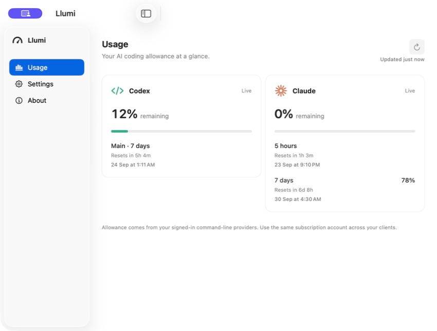

# Llumi

**Track your AI coding usage.**

Llumi monitors Codex and Claude Code usage on **macOS and Windows**, with native usage windows and a compact monitor that appears for supported coding activity.

[Website](https://tryllumi.com/) · [Privacy](https://tryllumi.com/privacy/) · [Support](https://tryllumi.com/support/)

## Availability

- **macOS 1.1.1:** production download pending. Requires macOS 14 or later; Apple Silicon and Intel.
- **Windows 2.0.2.0:** Microsoft Store certification pending. Requires Windows 10 22H2 or later, or Windows 11; x64. No direct Windows installer is offered.

Historical AgentMeter releases remain available in [release history](https://github.com/Praneshsivasankaran/Llumi/releases); they are not Llumi downloads.

## What it does

- Shows supported allowances, reset information and explicit unavailable states for each provider.
- Offers a contextual notch monitor on macOS and movable desktop monitor on Windows, with details on hover.
- Includes guided setup, setup diagnostics, optional startup and Light, Dark or System appearance.

Live usage requires separately installed, authenticated Codex CLI and/or standalone Claude Code and a supported provider subscription. Provider interfaces can change; unavailable values are never estimated.

## Privacy

No Llumi account, telemetry, analytics or backend. Llumi does not read prompts, responses, source code, terminal contents or keystrokes, and does not copy provider credentials. Usage checks send no model prompts. Provider tools retain their own authentication and contact their own services. [Privacy policy](PRIVACY.md).

## Development

[macOS build and tests](docs/macos/BUILD.md) · [Windows build and tests](docs/windows/BUILD.md) · [Website development](docs/PAGES.md) · [Shared product specification](docs/product-spec/README.md)

Product behavior is specified together and implemented natively on each platform. Preserve intentional migration identifiers and historical releases.

[Report an issue](https://github.com/Praneshsivasankaran/Llumi/issues/new/choose) · [Contribute](CONTRIBUTING.md) · [Security](SECURITY.md) · [Distribution](docs/DISTRIBUTION.md) · [Release handoff](docs/RELEASE-HANDOFF.md)

Llumi's original source is [MIT licensed](LICENSE). [Third-party materials and trademarks retain their own terms](THIRD-PARTY-NOTICES.md). Llumi is independent of OpenAI and Anthropic.
